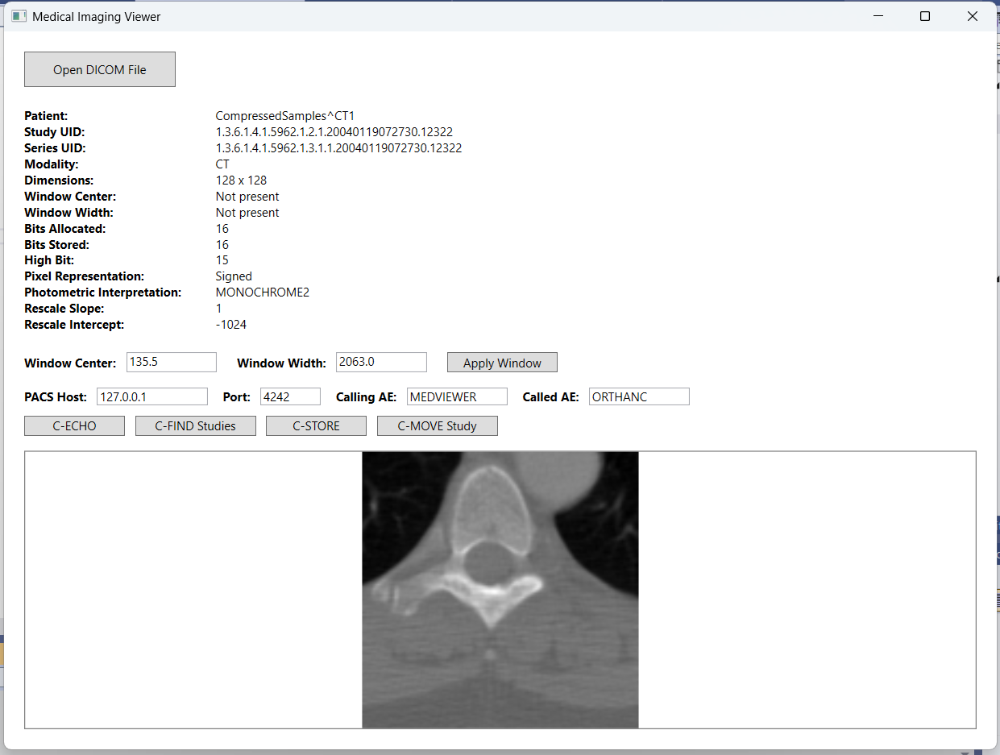
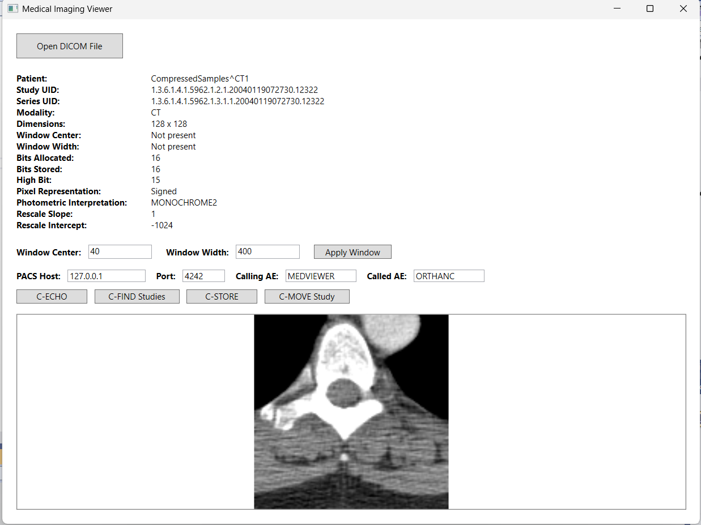
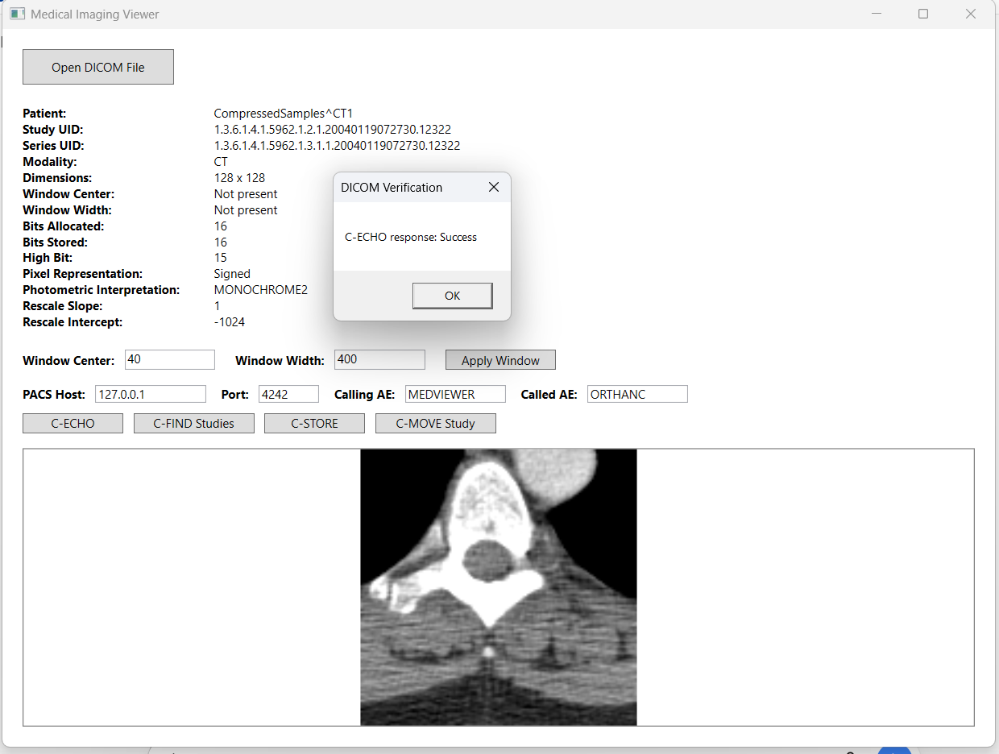
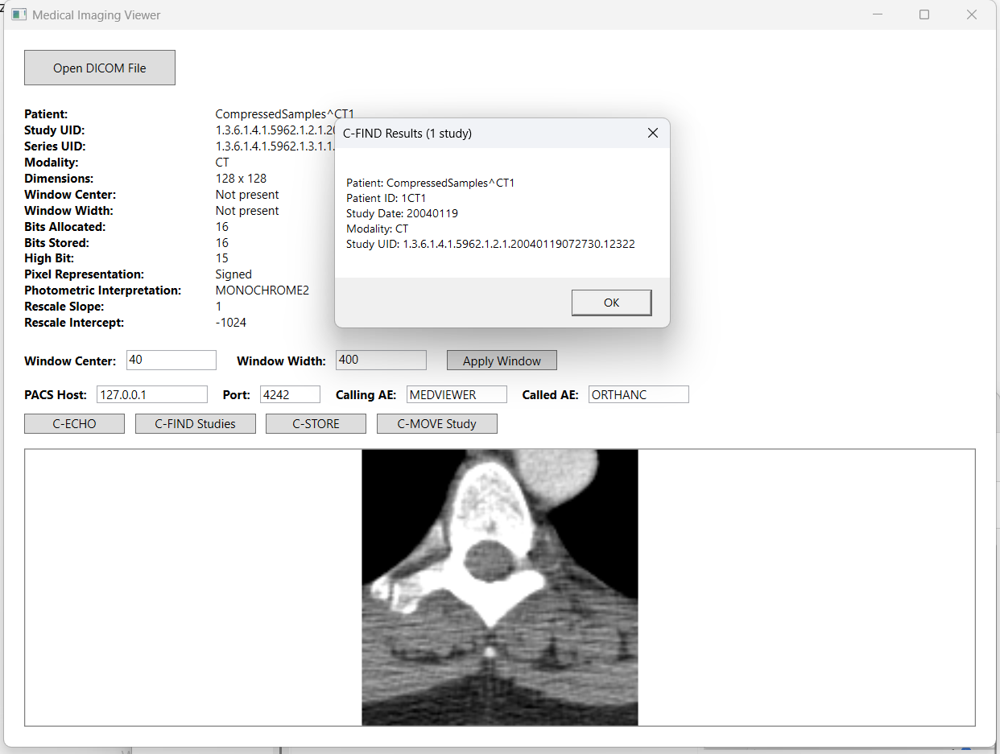
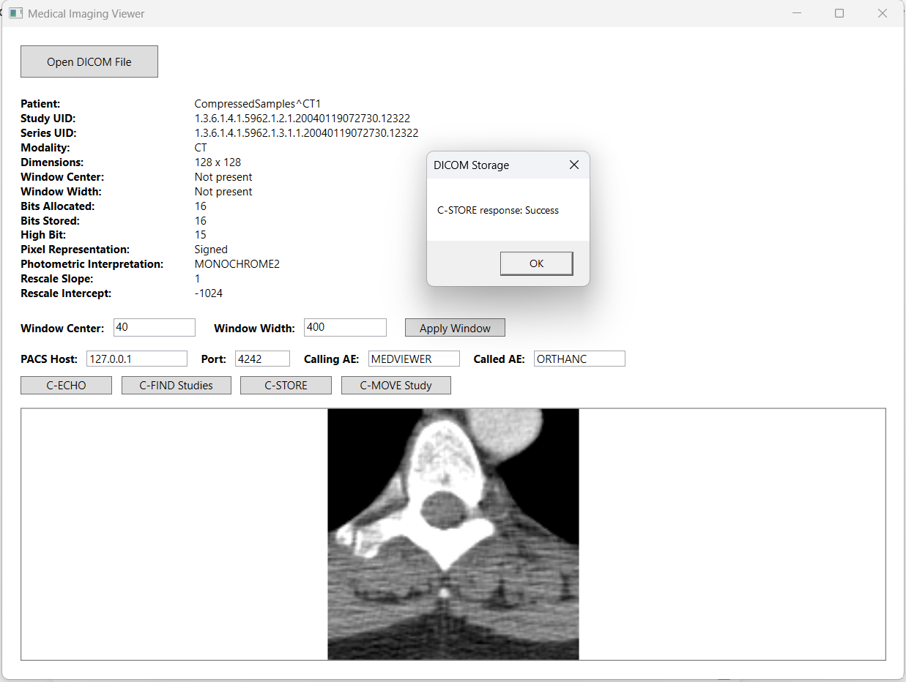
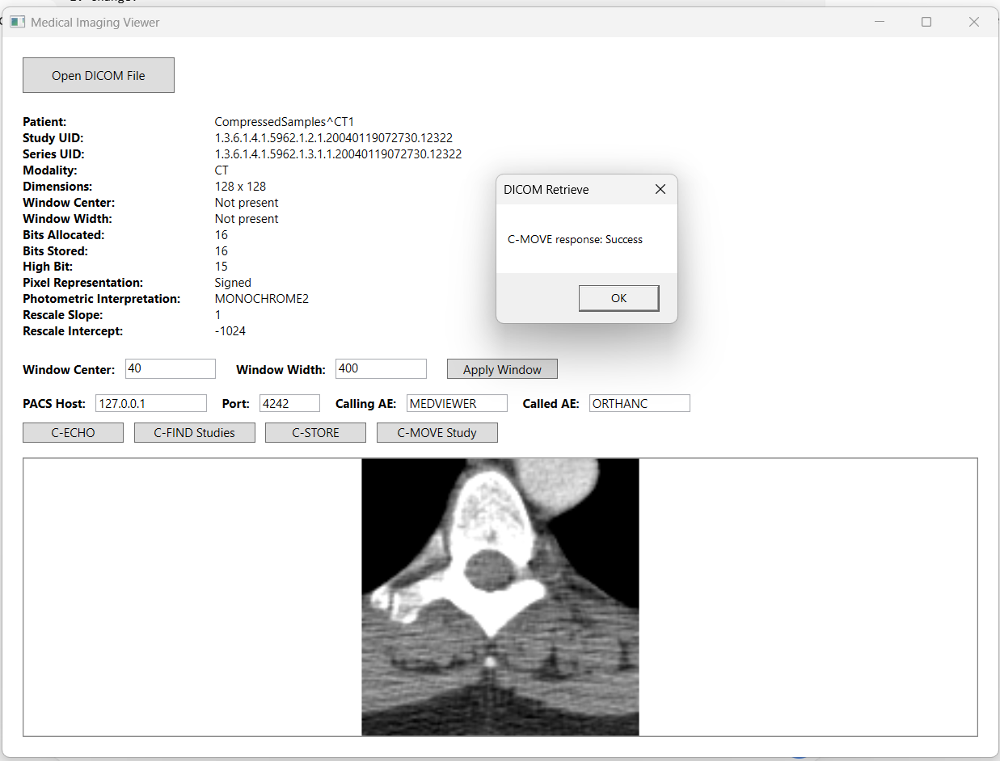
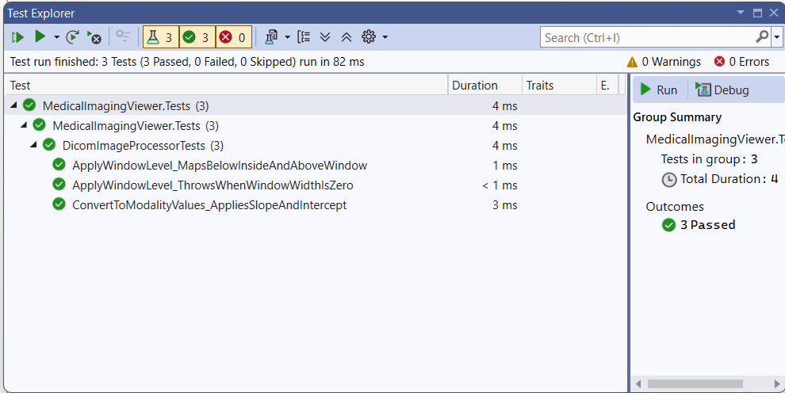

# Medical Imaging DICOM Viewer

A C#/.NET 8 WPF medical-imaging application demonstrating DICOM image processing and PACS interoperability using fo-dicom and an Orthanc DICOM server.

The project parses DICOM datasets and metadata, extracts and interprets CT Pixel Data, converts stored pixel values into Hounsfield Units, performs interactive Window/Level grayscale rendering, and implements core DICOM networking services including C-ECHO, C-FIND, C-STORE, and C-MOVE.

The application was intentionally designed to expose the underlying DICOM processing and networking workflows rather than hiding them completely behind high-level abstractions. The goal is to demonstrate understanding of DICOM datasets, SOP Instances, AE Titles, SCU/SCP roles, association-based communication, Query/Retrieve, medical-image pixel processing, and PACS interoperability.

> **Portfolio / educational project:** This application uses public test DICOM data and is not intended or validated for clinical diagnostic use.

---

## Application Preview

The viewer loads DICOM CT images, displays key DICOM metadata, processes CT Pixel Data into Hounsfield Units, and supports interactive Window/Level visualization.



### Interactive Window / Level

The same CT image displayed using Window Center `40` and Window Width `400`:



---

## Key Capabilities

- DICOM file loading and dataset parsing with fo-dicom
- DICOM metadata extraction and display
- 16-bit signed CT Pixel Data processing
- Rescale Slope / Rescale Intercept transformation
- Hounsfield Unit calculation
- Window Center / Window Width processing
- Automatic fallback Window/Level when DICOM WC/WW are absent
- Interactive Window/Level adjustment
- 8-bit grayscale image generation
- WPF `BitmapSource` image rendering
- DICOM C-ECHO verification
- DICOM C-FIND Study-level query
- DICOM C-STORE transmission
- DICOM C-MOVE Study-level retrieval
- Embedded C-STORE SCP for receiving retrieved DICOM instances
- Orthanc DICOM server interoperability
- Unit-tested image-processing logic

---

## Architecture

The project separates image-processing, rendering, DICOM networking, and user-interface responsibilities.

```text
MedicalImagingViewer
│
├── MainWindow
│   ├── DICOM file selection
│   ├── metadata presentation
│   ├── Window/Level controls
│   └── workflow orchestration
│
├── DicomImageProcessor
│   ├── stored pixel → modality value conversion
│   └── Window/Level → grayscale conversion
│
├── DicomImageRenderer
│   └── grayscale pixels → WPF BitmapSource
│
├── DicomNetworkService
│   ├── C-ECHO
│   ├── C-FIND
│   ├── C-STORE SCU
│   └── C-MOVE SCU
│
└── DicomStoreScp
    └── receives DICOM instances delivered through C-STORE
```

A separate xUnit project tests the image-processing layer independently of the WPF UI.

---

## DICOM Image-Processing Pipeline

The viewer intentionally processes the image pipeline explicitly:

```text
DICOM File
    ↓
fo-dicom Dataset
    ↓
Pixel Data
    ↓
16-bit Stored Pixel Values
    ↓
Rescale Slope / Rescale Intercept
    ↓
Hounsfield Units
    ↓
Window Center / Window Width
    ↓
Normalize and Clamp
    ↓
8-bit Grayscale Pixels
    ↓
WPF BitmapSource
    ↓
Displayed CT Image
```

For CT images, stored pixel values are transformed into modality values using:

```text
HU = StoredPixel × RescaleSlope + RescaleIntercept
```

For the public `CT_small.dcm` test image:

```text
Rescale Slope     = 1
Rescale Intercept = -1024
```

The resulting Hounsfield Unit values are then mapped through Window/Level processing into the 0–255 grayscale display range.

If Window Center and Window Width are absent from the DICOM dataset, the current prototype calculates a fallback display window from the minimum and maximum modality values.

This fallback is intended for demonstration and visualization rather than clinical display optimization.

---

## Interactive Window / Level

Window Center and Window Width can be changed at runtime without modifying the original DICOM Pixel Data.

For example:

```text
Window Center = 40
Window Width  = 400
```

changes the displayed grayscale mapping while the underlying stored pixels and Hounsfield Unit values remain unchanged.

This demonstrates the distinction between:

```text
Stored Pixel Data
        ↓
Modality Values / HU
        ↓
Display Transformation
```

---

## DICOM / PACS Networking

The application interoperates with an Orthanc DICOM server using standard DIMSE services.

### C-ECHO — Verification

C-ECHO verifies DICOM-level connectivity between two Application Entities.

```text
MEDVIEWER  ─── C-ECHO ───>  ORTHANC
```

A successful response verifies that the applications can establish a DICOM association and perform the Verification service.



---

### C-FIND — Query

C-FIND performs a Study-level query against Orthanc.

```text
MEDVIEWER  ─── C-FIND ───>  ORTHANC
            <── Studies ──
```

Returned information includes fields such as:

- Patient Name
- Patient ID
- Study Date
- Modality
- Study Instance UID



---

### C-STORE — Storage

MEDVIEWER can act as a C-STORE SCU and transmit a complete DICOM SOP Instance to Orthanc.

```text
MEDVIEWER                   ORTHANC

C-STORE SCU  ────────────>  C-STORE SCP
               DICOM
             SOP Instance
```

C-STORE transfers the DICOM object, including its metadata and Pixel Data.



---

## C-MOVE and the C-STORE Retrieval Workflow

C-MOVE is a DICOM Query/Retrieve operation.

A key architectural detail is that the requested DICOM instances are **not returned directly as image payloads over the original C-MOVE association**.

Instead, the C-MOVE requester specifies a destination AE Title. The source DICOM system then establishes a separate association with that destination and delivers the matching SOP Instances using C-STORE.

The project demonstrates this complete workflow:

```text
MEDVIEWER                              ORTHANC
    │                                     │
    │──── C-MOVE Study ──────────────────>│
    │     Destination = MEDVIEWER          │
    │                                     │
    │        separate association          │
    │                                     │
    │<──────────── C-STORE ───────────────│
    │         DICOM SOP Instance           │
    │                                     │
    ▼
ReceivedDicom/
<SOPInstanceUID>.dcm
```

The end-to-end retrieval was verified by receiving and saving the requested DICOM SOP Instance locally through the viewer's C-STORE SCP.



### Why implement a C-STORE SCP in the viewer?

MEDVIEWER acts as the SCU when requesting the C-MOVE operation.

However, during retrieval, Orthanc becomes the C-STORE SCU and the destination must provide the corresponding C-STORE SCP.

MEDVIEWER therefore hosts a C-STORE SCP on port `11112` so that it can receive the DICOM instances delivered as the result of a C-MOVE request.

This also demonstrates an important DICOM architectural concept:

> **SCU and SCP are service-specific roles. An application can act as an SCU for one DICOM service and an SCP for another.**

In this project:

| DICOM Service | MEDVIEWER | Orthanc |
|---|---|---|
| C-ECHO | SCU | SCP |
| C-FIND | SCU | SCP |
| C-STORE Send | SCU | SCP |
| C-MOVE | SCU | SCP |
| C-STORE during C-MOVE retrieval | SCP | SCU |

---

## Application Entities

The local interoperability environment uses:

```text
Orthanc
AE Title: ORTHANC
Host:     127.0.0.1
Port:     4242

Medical Imaging Viewer
AE Title: MEDVIEWER
Incoming DICOM Port: 11112
```

Orthanc is configured with MEDVIEWER as a known DICOM modality so that it can resolve the C-MOVE destination AE Title to the viewer's network endpoint.

---

## Testing

The solution contains an xUnit test project for the image-processing layer.

Current tests verify:

- Rescale Slope / Intercept modality transformation
- Window/Level mapping for values below, inside, and above the display window
- Validation that Window Width must be greater than zero

Current result:

```text
3 Passed
0 Failed
0 Skipped
```



---

## Technology Stack

- C#
- .NET 8
- WPF
- fo-dicom
- xUnit
- Orthanc DICOM Server
- Visual Studio 2022
- DICOM / DIMSE networking

---

## Public Test Data

Development and testing use the public pydicom `CT_small.dcm` sample dataset.

No proprietary medical images or private patient data are included in this repository.

---

## Implemented

- [x] DICOM file loading
- [x] DICOM metadata parsing
- [x] Pixel Data extraction
- [x] Signed 16-bit CT pixel interpretation
- [x] Rescale Slope / Intercept transformation
- [x] Hounsfield Unit processing
- [x] Window/Level grayscale conversion
- [x] Automatic fallback display window
- [x] Interactive Window/Level
- [x] WPF image rendering
- [x] Image-processing unit tests
- [x] Orthanc interoperability
- [x] C-ECHO
- [x] C-FIND Study Query
- [x] C-STORE SCU
- [x] C-MOVE Study retrieval
- [x] C-STORE SCP
- [x] End-to-end C-MOVE → C-STORE retrieval

---

## Roadmap

Future extensions may include:

- [ ] Study / Series browser
- [ ] Series navigation and multi-instance image stacks
- [ ] DICOM anonymization
- [ ] DICOMDIR support
- [ ] DICOMweb
- [ ] Caching and image-loading performance improvements
- [ ] CT volume construction
- [ ] Patient-space 3D geometry
- [ ] Multiplanar Reconstruction (MPR)
- [ ] Native C++ / OpenCV image-processing component
- [ ] CMake-based native library build
- [ ] C# / C++ interoperability through P/Invoke

---

## Project Purpose

This project is a hands-on medical-imaging software engineering portfolio project focused on the architecture and implementation of DICOM image-processing and interoperability workflows.

Rather than implementing an entire PACS, the application interoperates with Orthanc as an external DICOM server. This reflects a typical software-engineering approach in which a viewer, workstation, image-processing application, or medical-imaging service integrates with established PACS infrastructure using standard DICOM interfaces.

The project also provides a foundation for future work in 3D medical-image geometry, advanced visualization, image-processing algorithms, and native C++ processing.